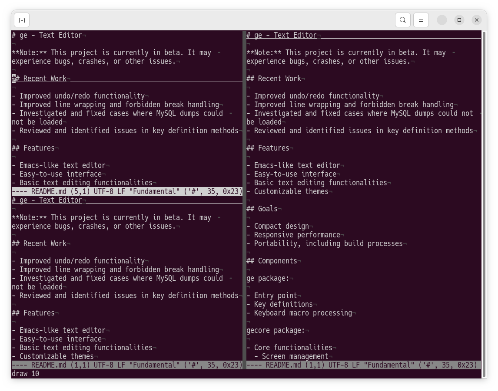

# ge - Text Editor

**Note:** This project is currently in beta. It may experience bugs, crashes, or other issues.

## Recent Work

- Improved undo/redo functionality
- Improved line wrapping and forbidden break handling
- Investigated and fixed cases where MySQL dumps could not be loaded
- Reviewed and identified issues in key definition methods

## Features

- Emacs-like text editor
- Easy-to-use interface
- Basic text editing functionalities
- Customizable themes

## Goals

- Compact design
- Responsive performance
- Portability, including build processes

## Components

ge package:

- Entry point
- Key definitions
- Keyboard macro processing

gecore package:

- Core functionalities
  - Screen management
  - Tree structure
  - Kill buffer

utils package:

- Utility functions

editorview package:

- Text editor functionalities
- Default view in ge (TreeLeaf interface)

theme package:

- Color definitions
- Mark character definitions

lang package:

- Support file types
  - Fundamental, Go, ...

locale package:

- Support languages
  - English, Japanese, ...

**Near-Term Goals:**
- Functionality and code optimization
- Bug resolution

This text editor project is inspired by Godit (https://github.com/nsf/godit).

## Installation

To install ge, you need to have Go installed on your system. Then, you can use the following script:

```bash
#!/bin/bash
set -euo pipefail

# Distribution directory
DIST_DIR="$(pwd)/dist"
mkdir -p "$DIST_DIR"

# Working directory for cloning repositories
WORKDIR="$(pwd)/tmp_build"
mkdir -p "$WORKDIR"

# List of target repositories
# Format: "repo_name git_url"
REPOS=(
  "ge         github.com/ge-editor/ge"
  "gecore     github.com/ge-editor/gecore"
  "locale     github.com/ge-editor/locale"
  "langs      github.com/ge-editor/langs"
  "theme      github.com/ge-editor/theme"
  "editorview github.com/ge-editor/editorview"
  "utils      github.com/ge-editor/utils"
)

# 1. Clone all repositories
echo "=== Cloning repositories ==="
for r in "${REPOS[@]}"; do
  NAME=$(echo "$r" | awk '{print $1}')
  URL=$(echo "$r" | awk '{print $2}')
  if [ ! -d "$WORKDIR/$NAME" ]; then
    git clone "https://$URL.git" "$WORKDIR/$NAME"
  else
    echo "$NAME already cloned"
  fi
done

# 2. Set local replace directives in go.mod
echo "=== Setting local replace directives ==="
for r in "${REPOS[@]}"; do
  NAME=$(echo "$r" | awk '{print $1}')
  REPO_DIR="$WORKDIR/$NAME"
  echo "Processing $NAME"

  pushd "$REPO_DIR" > /dev/null
  for dep in "${REPOS[@]}"; do
    DEP_NAME=$(echo "$dep" | awk '{print $1}')
    DEP_URL=$(echo "$dep" | awk '{print $2}')
    DEP_DIR="$WORKDIR/$DEP_NAME"

    if [ "$NAME" != "$DEP_NAME" ]; then
      # Remove existing replace if any, then add new one
      go mod edit -dropreplace "$DEP_URL" || true
      go mod edit -replace "$DEP_URL=$DEP_DIR"
    fi
  done
  go mod tidy
  popd > /dev/null
done

# 3. Build all modules
echo "=== Building modules ==="
# Check if REPOS array is not empty
if [ ${#REPOS[@]} -gt 0 ]; then
  # Process only the first item of the array
  r="${REPOS[0]}"
  NAME=$(echo "$r" | awk '{print $1}')
  REPO_DIR="$WORKDIR/$NAME"
  pushd "$REPO_DIR" > /dev/null
  make
  # Adjust this according to the actual binary name produced by Makefile
  cp "$NAME" "$DIST_DIR/$NAME" || echo "Binary $NAME not found, skipping copy"
  popd > /dev/null
fi

echo "=== Build finished. Binaries are in $DIST_DIR ==="
```

## Usage

After installing ge, you can start it by running the ge command in your terminal.

```bash
./ge <text file>
```

## Contributing

Contributions are welcome! If you find any issues or have suggestions for improvement, please feel free to open an issue or create a pull request.

## License

This project is licensed under the MIT License - see the LICENSE file for details.

---

## List of keybindings

### Basic things:
|  key                |  function                             |
|---------------------|---------------------------------------|
| C-g                 | Universal cancel button
| C-x C-c             | Quit from the godit
| C-x C-s             | Save file [prompt maybe]
| C-x w               | Save file as [prompt maybe]
| ~~C-x S~~           | ~~Save file (raw) [prompt maybe]~~
| ~~C-x M-s~~         | ~~Save file as [prompt]~~
| ~~C-x M-S~~         | ~~Save file as (raw) [prompt]~~
| C-x C-f             | Open file
| M-g                 | Go to line [prompt]
| C-/                 | Undo
| C-x C-/ (C-/...)    | Redo

### View/buffer operations:
|  key                |  function                             |
|---------------------|---------------------------------------|
| ~~C-x C-w~~         | ~~View operations mode~~
| C-x C-w             | View operations mode
| ~~C-x 0~~           | ~~Kill active view~~
| ~~C-x 1~~           | ~~Kill all views but active~~
| ~~C-x 2~~           | ~~Split active view vertically~~
| ~~C-x 3~~           | ~~Split active view horizontally~~
| ~~C-x o~~           | ~~Make a sibling view active~~
| C-x o               | Cycle through views
| C-x b               | Switch buffer in the active view [prompt]
| C-x k               | Kill buffer in the active view

### View operations mode:
|  key                |  function                             |
|---------------------|---------------------------------------|
| v                   | Split active view vertically
| h                   | Split active view horizontally
| k                   | Kill active view
| t                   | Insert view to top
| r                   | Insert view to right
| b                   | Insert view to bottom
| l                   | Insert view to left
| s                   | Switch split direction
| C-f, \<right>       | Expand/shrink active view to the right
| C-b, \<left>        | Expand/shrink active view to the left
| C-n, \<down>        | Expand/shrink active view to the bottom
| C-p, \<up>          | Expand/shrink active view to the top
| 1, 2, 3, 4, ...     | Select view

### Cursor/view movement and text editing:
|  key                |  function                             |
|---------------------|---------------------------------------|
| C-f, \<right>       | Move cursor one character forward
| Shift-\<left>       | Move cursor one word backward
| C-b, \<left>        | Move cursor one character backward
| Shift-\<right>      | Move cursor one word forward
| C-n, \<down>        | Move cursor to the next line
| C-p, \<up>          | Move cursor to the previous line
| C-e                 | Move cursor to the end of line
| \<end>              | Move cursor to the end of logical line
| C-a                 | Move cursor to the beginning of the line
| \<home>             | Move cursor to the beginning of the logical line
| C-v, \<pgdn>        | Move view forward (half of the screen)
| M-v, \<pgup>        | Move view backward (half of the screen)
| ESC \>              | Move cursor to the end of file
| ESC \<              | Move cursor to the beginning of the file
| ~~C-l~~             | ~~Center view on line containing cursor~~
| ~~C-j~~             | ~~Insert a newline character and autoindent~~
| C-j                 | Insert a newline character
| C-m, \<enter>       | Insert a newline character and autoindent
| C-h, \<backspace>   | Delete one character backwards
| C-d, \<delete>      | Delete one character in-place
| ~~M-d~~             | ~~Kill word~~
| ~~M-\<backspace>~~  | ~~Kill word backwards~~
| C-k                 | Kill line
| C-u                 | Kill line backwards
| ~~M-u~~             | ~~Convert the following word to upper case~~
| ~~M-l~~             | ~~Convert the following word to lower case~~
| ~~M-c~~             | ~~Capitalize the following word~~

### Search and replace operations:
|  key                |  function                             |
|---------------------|---------------------------------------|
| C-s, C-r            | Into Search and replace mode [interactive prompt]
| ~~C-r~~             | ~~Search and replace backward, into search and replace mode [interactive prompt]~~
| C-s                 | Move to forward matched word
| C-r                 | Move to backward matched word
| C-e                 | Replace on cursor
| ~~C-a~~             | ~~Replace All~~
| C-y                 | Yank and replace on minibuffer from kill buffer
| ~~C-/~~             | ~~Undo~~

### Mark and region operations:
|  key                |  function                             |
|---------------------|---------------------------------------|
| C-@, C-\<space>     | Set mark
| C-x C-x             | Swap cursor and mark locations
| M-u                 | Open mark list
| ~~C-x > (>...)~~    | ~~Indent region (lines between the cursor and the mark)~~
| ~~C-x \< (\<...)~~  | ~~Outdent region (lines between the cursor and the mark)~~
| ~~C-x C-r~~         | ~~Search & replace (within region) [prompt]~~
| ~~C-x C-u~~         | ~~Convert the region to upper case~~
| ~~C-x C-l~~         | ~~Convert the region to lower case~~
| C-w                 | Kill region (between the cursor and the mark)
| ESC-w, M-w          | Copy region (between the cursor and the mark)
| C-y                 | Yank (aka Paste) previously killed/copied text
| C-x i               | Yank (aka Paste) from clipboard text
| ~~M-q~~             | ~~Fill region (lines between the cursor and the mark) [prompt]~~

### Advanced:
|  key                |  function                             |
|---------------------|---------------------------------------|
| [F2]                | ~~Refactoring~~
| [F4]                | ~~case...~~
| ~~M-/~~             | ~~Local words autocompletion~~
| ~~C-x C-a~~         | ~~Invoke buffer specific autocompletion menu [menu]~~
| C-x (               | Start keyboard macro recording
| C-x )               | Stop keyboard macro recording
| C-x e (e...)        | Stop keyboard macro recording and execute it
| C-x =               | Info about character under the cursor
| C-x I               | Insert date
| ~~C-x !~~           | ~~Filter region through an external command [prompt]~~
| C-z                 | Suspend

### Reserved:
|  key                |  function                             |
|---------------------|---------------------------------------|
| C-;                 | Use japanese input method

## Screenshot



## Comment

Previously, in an attempt to manage module dependencies, I created tags in these repositories.
This affected the Go module cache. I will avoid doing this in the future and handle tag management more carefully.

---
