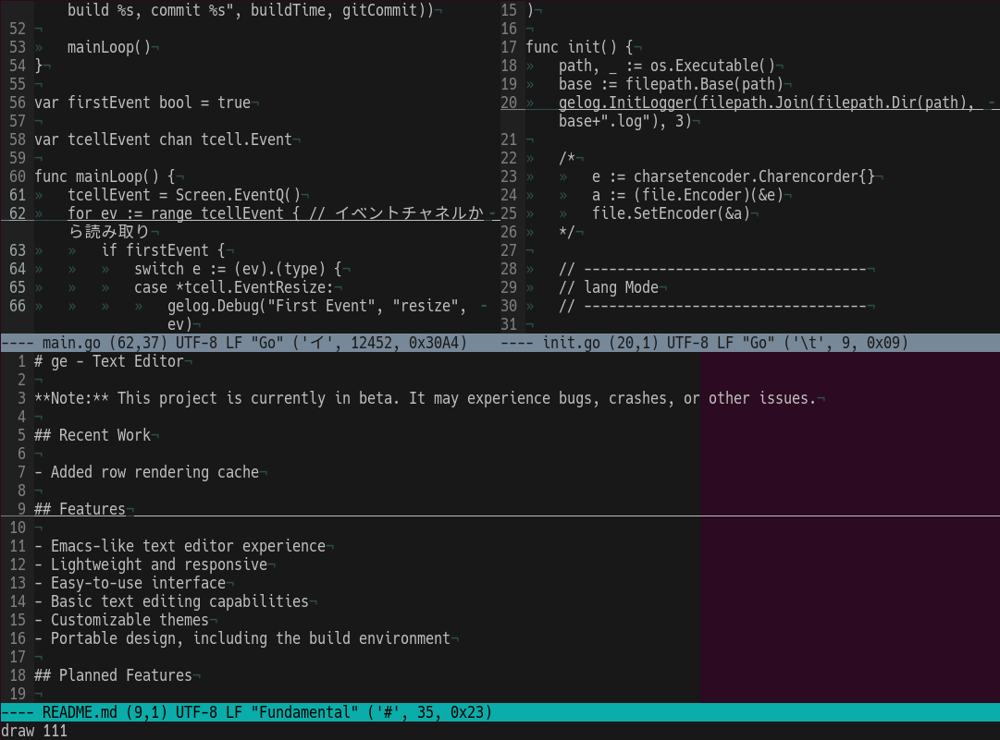

# ge - Text Editor

**Note:** This project is currently in beta. It may experience bugs, crashes, or other issues.

## Recent Work

- Improved line wrapping and forbidden break handling
- Reviewed and identified issues in key definition methods

## Features

- Emacs-like text editor
- Easy-to-use interface
- Basic text editing functionalities
- Customizable themes

## Goals

- Compact design
- Responsive performance
- Portability, including build processes

## Near-Term Goals

- Functionality and code optimization
- Bug resolution

This text editor project is inspired by Godit (https://github.com/nsf/godit).

---

## Components

editorleaf package:

ge package:

- Entry point
- Key definitions

gecore package:

- Core functionalities
- Text editor functionalities
- Default view in ge (TreeLeaf interface)

gelog package:

- Logging functionalities

keychord package:

- Key binding management functionalities

language package:

- Support file types

locale package:

- Support languages

theme package:

- Color definitions
- Mark character definitions

utils package

- Utility functions

## Packages Dependencies

- ge
	- editorleaf
		- gecore
			- gelog		(No dependencies)
			- keychord
				- gelog	(No dependencies)
			- locale	(No dependencies)
			- theme		(No dependencies)
			- utils		(No dependencies)
		- gelog			(No dependencies)
		- keychord
			- gelog	(No dependencies)
		- locale	(No dependencies)
		- theme		(No dependencies)
		- utils		(No dependencies)
	- gecore
		- gelog		(No dependencies)
		- keychord
			- gelog	(No dependencies)
		- locale	(No dependencies)
		- theme		(No dependencies)
		- utils		(No dependencies)
	- gelog			(No dependencies)
	- keychord
		- gelog		(No dependencies)
	- language
		- gecore
			- gelog		(No dependencies)
			- keychord
				- gelog	(No dependencies)
			- locale	(No dependencies)
			- theme		(No dependencies)
			- utils		(No dependencies)
	- utils				(No dependencies)

---

## Installation

```bash
$ go install github.com/ge-editor/ge@latest
```

## Development

```bash
$ git clone https://github.com/ge-editor/ge
$ cd ge
$ make
```

## Usage

After installing ge, you can start it by running the ge command in your terminal.

```bash
./ge <text file>
```

---

## List of keybindings

### Basic things:
|  key                |  function                             |
|---------------------|---------------------------------------|
| C-g                 | Universal cancel button
| C-x C-c             | Quit from the ge
| C-x C-s             | Save file [prompt maybe]
| C-x w               | Save file as [prompt maybe]
| C-x C-f             | Open file
| M-g                 | Go to line [prompt]
| C-/                 | Undo
| C-x / (/...)        | Redo

### View/buffer operations:
|  key                |  function                             |
|---------------------|---------------------------------------|
| C-x C-w             | View operations mode
| ~~C-x 0~~           | ~~Kill active view~~
| ~~C-x 1~~           | ~~Kill all views but active~~
| ~~C-x 2~~           | ~~Split active view vertically~~
| ~~C-x 3~~           | ~~Split active view horizontally~~
| ~~C-x o~~           | ~~Make a sibling view active~~
| C-x o               | Cycle through views
| C-x b               | Switch buffer in the active view [prompt]
| C-x k               | Kill buffer in the active view

### View operations mode:
|  key                |  function                             |
|---------------------|---------------------------------------|
| v                   | Split active view vertically
| h                   | Split active view horizontally
| k                   | Kill active view
| t                   | Insert view to top
| r                   | Insert view to right
| b                   | Insert view to bottom
| l                   | Insert view to left
| s                   | Switch split direction
| C-f, \<right>       | Expand/shrink active view to the right
| C-b, \<left>        | Expand/shrink active view to the left
| C-n, \<down>        | Expand/shrink active view to the bottom
| C-p, \<up>          | Expand/shrink active view to the top
| 1, 2, 3, 4, ...     | Select view

### Cursor/view movement and text editing:
|  key                |  function                             |
|---------------------|---------------------------------------|
| C-f, \<right>       | Move cursor one character forward
| Shift-\<left>       | Move cursor one word backward
| C-b, \<left>        | Move cursor one character backward
| Shift-\<right>      | Move cursor one word forward
| C-e                 | Move cursor to the end of logical line
| \<end>              | Move cursor to the end of line
| C-a                 | Move cursor to the beginning of the logical line
| \<home>             | Move cursor to the beginning of the line
| C-v, \<pgdn>        | Move view forward (half of the screen)
| M-v, \<pgup>        | Move view backward (half of the screen)
| ESC \>              | Move cursor to the end of file
| ESC \<              | Move cursor to the beginning of the file
| C-l                 | Center view on line containing cursor
| C-m, \<enter>       | Insert a newline character and autoindent
| C-j                 | Insert a newline character
| C-h, \<backspace>   | Delete one character backwards
| C-d, \<delete>      | Delete one character in-place
| ~~M-d~~             | ~~Kill word~~
| ~~M-\<backspace>~~  | ~~Kill word backwards~~
| C-k                 | Kill line
| C-u                 | Kill line backwards

### Search and replace operations:
|  key                |  function                             |
|---------------------|---------------------------------------|
| C-s, C-r            | Into Search and replace mode [interactive prompt]
| ~~C-r~~             | ~~Search and replace backward, into search and replace mode [interactive prompt]~~
| C-s                 | Move to forward matched word
| C-r                 | Move to backward matched word
| C-e                 | Replace on cursor
| ~~C-a~~             | ~~Replace All~~
| C-y                 | Yank and replace on minibuffer from kill buffer

### Mark and region operations:
|  key                |  function                             |
|---------------------|---------------------------------------|
| C-@, C-\<space>     | Set mark
| C-x C-x             | Swap cursor and mark locations
| M-u                 | Open mark list
| ~~C-x > (>...)~~    | ~~Indent region (lines between the cursor and the mark)~~
| ~~C-x \< (\<...)~~  | ~~Outdent region (lines between the cursor and the mark)~~
| ~~C-x C-r~~         | ~~Search & replace (within region) [prompt]~~
| ~~C-x C-u~~         | ~~Convert the region to upper case~~
| ~~C-x C-l~~         | ~~Convert the region to lower case~~
| C-w                 | Kill region (between the cursor and the mark)
| ESC-w, M-w          | Copy region (between the cursor and the mark)
| C-y                 | Yank (aka Paste) previously killed/copied text
| C-x i               | Yank (aka Paste) from clipboard text
| ~~M-q~~             | ~~Fill region (lines between the cursor and the mark) [prompt]~~

### Advanced:
|  key                |  function                             |
|---------------------|---------------------------------------|
| M-p                 | Command palette
| [F2]                | ~~Refactoring~~
| [F4]                | ~~case...~~
| ~~M-u~~             | ~~Convert the following word to upper case~~
| ~~M-l~~             | ~~Convert the following word to lower case~~
| ~~M-c~~             | ~~Capitalize the following word~~
| ~~M-/~~             | ~~Local words autocompletion~~
| ~~C-x C-a~~         | ~~Invoke buffer specific autocompletion menu [menu]~~
| C-x =               | Info about character under the cursor
| C-x I               | Insert date
| C-z                 | Suspend

### Keyboard Macro:
|  key                |  function                             |
|---------------------|---------------------------------------|
| C-x (               | Start keyboard macro recording
| C-x )               | Stop keyboard macro recording
| C-x e (e...)        | Stop keyboard macro recording and execute it

## Screenshot



---

## License

This project is licensed under the MIT License.

---
